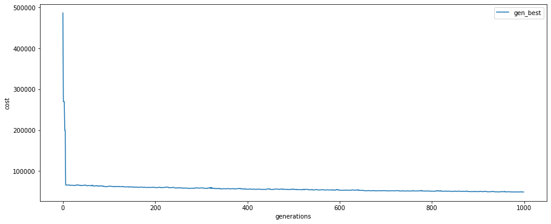

# __Lab2 - Set covering using a Genetic Algorithm__

> Author: Luigi Federico  
>  
> Computational Intelligence 2022/23  
> Prof: G. Squillero

---

## __Solution proposed__

I implemented a genetic algorithm that operates as follows:  
> For each generation:  
> 1. Randomply select two parents, both through a tournament  
> 2. Let those parents reproduce, generating the offspring  
> 3. With a certain probability, the offspring could mutate  
> 4. After having generated the entire offspring, they are added to the starting population and sorted baserd on the individual cost. Cost-based evolutionary selection is applied to have the population of the next generation.  
> 
> The best individual of the last generation will be the winner of the selection, i.e. the proposed solution


### __Reproduction__

The reproduction is "smart", i.e. it's not a random crossover but there is a selection of the genes that will compose the genome of the offspring individual.  

The reproduction between two individuals works as follows:
1. All the genes of both the genomes are grouped toghether and the duplicate are removed.
2. The genes are iterativelly selected by looking for the best gene among the candidates. The selection is based on how much the gene would contribute to the solution and on the length of the gene.
```Python
best = max(candidates, key=lambda gene: (len(goal) - len(covered | gene.values), -len(gene)))
```
3. When there are no candidates left or it has selected a maximum of N genes, the genome of the new individual is ready.

### __Mutation__

The mutation concerns a randomly chosen gene of the genome that is replaced with another gene (different from the other already present inside the genome)


---
---

## __Results__

Running the algorithm with different values of N we obtain the following results.

> The winner statistics are the following:
> - Success = 100 * number_of_covered_values / N
> - Cost = weighted number of digits left to find the goal state + the weighted len of the list
> - Ideal_Cost = W_FACTOR * N 
> - Genome = set of covered values

---

### __N=5__

Winner individual: 

<details>
<summary>Genome (click me):</summary>
[0]
[2]
[4]
[1, 3]
</details>

- Success = 100.0%
- Genome Length = 5
- Length - Idael_Length = 0
- Cost of best individual per generation:


---

### __N=10__

Winner individual: 

<details>
<summary>Genome (click me):</summary>
[6]
[0, 3]
[6, 9]
[2, 7, 8]
[0, 4]
[1, 3, 5]
</details>

- Success = 100.0%
- Genome Length = 13
- Length - Idael_Length = 3
- Cost of best individual per generation:


---

### __N=20__

Winner individual: 

<details>
<summary>Genome (click me):</summary>
[5, 8, 16]
[0, 1, 2, 7]
[4, 7, 8]
[3, 6, 7, 13, 15]
[3, 6, 7, 10, 14, 17]
[2, 3, 9, 11, 12, 17, 18, 19]
</details>

- Success = 100.0%
- Genome Length = 29
- Length - Idael_Length = 9

- Cost of best individual per generation:


---

### __N=100__

Winner individual: 

<details>
<summary>Genome (click me):</summary>
[2, 3, 14, 15, 19, 20, 24, 27, 32, 41, 46, 65, 66, 68, 77, 94, 97]
[1, 5, 11, 15, 19, 20, 21, 31, 35, 47, 50, 60, 63, 74, 76, 88, 98]
[3, 11, 13, 16, 23, 34, 39, 45, 46, 52, 55, 56, 57, 65, 70, 71, 97]
[2, 8, 18, 20, 22, 23, 24, 36, 39, 50, 58, 62, 63, 72, 77, 82, 87, 93]
[2, 10, 12, 16, 29, 31, 34, 38, 52, 57, 70, 71, 72, 75, 81, 83, 86, 97]
[0, 1, 5, 7, 12, 27, 34, 43, 48, 54, 60, 62, 66, 74, 77, 85, 96, 97]
[0, 2, 14, 18, 23, 30, 37, 45, 53, 54, 63, 65, 68, 73, 76, 78, 80, 85, 91]
[4, 9, 10, 12, 15, 25, 29, 33, 35, 37, 42, 45, 46, 56, 64, 65, 69, 82, 86]
[9, 11, 12, 14, 19, 29, 32, 33, 37, 58, 63, 65, 73, 82, 85, 92, 99]
[1, 3, 11, 19, 20, 26, 33, 41, 50, 55, 69, 70, 73, 75, 79, 80, 90, 97, 98]
[6, 12, 15, 18, 20, 24, 30, 31, 34, 37, 40, 41, 49, 53, 57, 59, 73, 78, 92, 97]
[1, 7, 15, 17, 20, 22, 33, 39, 44, 58, 63, 66, 77, 78, 84, 85, 89, 90, 92, 94]
[3, 4, 7, 11, 13, 15, 24, 27, 28, 32, 36, 44, 57, 67, 76, 79, 81, 84, 87, 90, 92]
[6, 10, 16, 17, 25, 33, 43, 50, 51, 55, 60, 61, 62, 64, 70, 71, 73, 89, 95, 97, 99]
</details>

- Success = 100.0%
- Genome Length = 261
- Length - Idael_Length = 161

- Cost of best individual per generation:


---

### __N=500__

Winner individual: 

<details>
<summary>Genome (click me):</summary>
[11, 16, 17, 20, 24, 38, 60, 66, 75, 78, 79, 86, 102, 108, 117, 120, 122, 126, 134, 138, 139, 140, 141, 142, 151, 155, 157, 158, 178, 191, 197, 200, 201, 204, 206, 211, 224, 227, 232, 239, 242, 248, 249, 258, 260, 261, 265, 266, 267, 268, 275, 277, 278, 279, 294, 296, 304, 306, 308, 321, 322, 336, 348, 353, 355, 359, 370, 372, 380, 383, 387, 388, 392, 395, 403, 411, 417, 419, 422, 455, 464, 485, 486, 493, 494, 498]
[3, 14, 33, 37, 38, 52, 62, 66, 69, 79, 83, 109, 113, 117, 118, 119, 126, 141, 147, 151, 169, 188, 196, 203, 208, 210, 216, 217, 223, 225, 228, 229, 240, 241, 256, 257, 261, 262, 272, 285, 287, 288, 301, 312, 313, 322, 323, 331, 333, 334, 336, 338, 339, 342, 352, 354, 357, 362, 367, 376, 377, 378, 380, 384, 385, 386, 389, 397, 402, 409, 415, 416, 418, 427, 431, 434, 436, 437, 439, 441, 451, 454, 463, 471, 484, 485, 486, 492, 497, 499]
[0, 12, 14, 19, 36, 46, 56, 57, 61, 66, 77, 78, 82, 88, 91, 104, 106, 113, 116, 117, 122, 124, 137, 139, 143, 145, 149, 151, 159, 168, 170, 187, 190, 191, 206, 207, 215, 220, 226, 230, 231, 249, 268, 278, 279, 282, 287, 289, 303, 314, 326, 331, 335, 347, 348, 350, 353, 355, 366, 375, 378, 382, 384, 389, 396, 397, 400, 404, 405, 409, 417, 426, 432, 435, 436, 443, 444, 449, 451, 458, 465, 468, 472, 474, 481, 483, 484, 486, 487, 498]
[0, 16, 17, 20, 21, 25, 34, 37, 39, 48, 65, 69, 89, 91, 93, 100, 102, 103, 121, 139, 152, 157, 162, 171, 175, 178, 181, 186, 187, 204, 207, 214, 220, 224, 226, 232, 247, 250, 256, 258, 261, 264, 276, 282, 284, 285, 286, 288, 290, 292, 295, 306, 308, 311, 313, 314, 319, 320, 321, 325, 331, 336, 337, 340, 343, 351, 357, 364, 380, 391, 393, 404, 405, 406, 414, 417, 418, 422, 424, 426, 430, 435, 436, 440, 443, 454, 465, 471, 493, 498]
[1, 8, 16, 28, 34, 45, 46, 68, 75, 79, 84, 85, 89, 92, 95, 109, 110, 118, 119, 123, 124, 129, 133, 141, 142, 143, 146, 153, 154, 157, 161, 173, 175, 181, 188, 190, 191, 192, 196, 198, 204, 206, 210, 216, 230, 232, 233, 236, 246, 248, 254, 256, 269, 272, 273, 280, 282, 294, 298, 300, 302, 307, 314, 316, 319, 328, 333, 343, 348, 354, 359, 360, 362, 364, 367, 368, 373, 375, 379, 400, 426, 429, 437, 439, 442, 444, 448, 453, 465, 468]
[2, 6, 8, 9, 12, 18, 23, 28, 50, 53, 56, 70, 71, 80, 83, 85, 106, 113, 115, 116, 125, 126, 129, 147, 152, 157, 160, 161, 165, 169, 172, 174, 175, 180, 182, 188, 195, 196, 197, 210, 213, 219, 223, 252, 264, 267, 270, 272, 277, 284, 287, 289, 300, 303, 310, 313, 320, 327, 343, 359, 362, 363, 372, 374, 381, 386, 390, 393, 396, 398, 399, 421, 433, 436, 443, 451, 452, 461, 464, 468, 476, 477, 479, 480, 485, 488, 489, 490, 491, 493, 496]
[2, 3, 8, 15, 23, 29, 30, 36, 40, 46, 48, 49, 55, 64, 78, 85, 94, 97, 98, 102, 113, 122, 128, 137, 143, 150, 157, 158, 168, 179, 191, 192, 195, 207, 212, 214, 217, 230, 232, 237, 241, 248, 252, 253, 260, 271, 272, 273, 282, 289, 292, 296, 298, 301, 303, 312, 315, 316, 318, 320, 321, 329, 332, 349, 351, 354, 361, 367, 368, 374, 375, 378, 384, 389, 392, 396, 402, 404, 406, 408, 416, 422, 423, 439, 445, 456, 472, 473, 485, 490, 495]
[1, 16, 20, 21, 26, 29, 34, 45, 50, 54, 56, 57, 59, 61, 71, 72, 79, 84, 85, 86, 87, 88, 91, 94, 100, 101, 104, 108, 118, 119, 129, 143, 144, 146, 163, 166, 171, 178, 187, 194, 199, 200, 210, 217, 219, 227, 235, 239, 240, 241, 246, 250, 251, 254, 270, 275, 285, 295, 313, 318, 321, 323, 333, 336, 345, 346, 357, 376, 377, 380, 383, 389, 394, 395, 399, 401, 410, 420, 423, 424, 427, 441, 443, 447, 448, 467, 470, 474, 483, 488, 489, 499]
[14, 18, 20, 26, 46, 55, 74, 78, 81, 91, 95, 97, 102, 106, 130, 133, 134, 139, 143, 145, 154, 171, 176, 182, 185, 190, 192, 195, 198, 200, 205, 208, 213, 214, 223, 231, 234, 237, 241, 248, 253, 256, 260, 263, 268, 271, 276, 277, 281, 282, 283, 284, 291, 294, 295, 298, 303, 310, 318, 324, 327, 331, 335, 337, 344, 346, 351, 353, 369, 371, 386, 391, 395, 396, 397, 399, 407, 413, 417, 419, 422, 424, 435, 450, 458, 459, 464, 474, 475, 478, 484, 487]
[17, 22, 38, 42, 45, 49, 50, 55, 57, 75, 80, 82, 83, 85, 88, 95, 99, 102, 105, 108, 114, 117, 124, 128, 136, 140, 141, 145, 148, 152, 154, 155, 156, 157, 161, 165, 167, 170, 171, 181, 193, 194, 197, 205, 214, 219, 222, 237, 246, 261, 264, 273, 276, 278, 280, 283, 289, 296, 300, 302, 308, 309, 325, 326, 327, 329, 331, 332, 334, 338, 347, 353, 358, 360, 378, 392, 394, 400, 405, 406, 412, 415, 422, 425, 427, 428, 437, 444, 447, 449, 452, 455, 473]
[4, 13, 20, 21, 22, 29, 32, 38, 39, 42, 48, 49, 53, 54, 56, 57, 77, 78, 80, 88, 90, 92, 99, 104, 114, 119, 125, 132, 134, 139, 151, 152, 158, 161, 162, 167, 171, 173, 190, 193, 199, 205, 209, 213, 220, 222, 223, 237, 255, 261, 263, 271, 273, 274, 275, 278, 282, 284, 293, 297, 298, 302, 318, 319, 328, 330, 335, 339, 340, 342, 358, 360, 364, 368, 370, 383, 387, 389, 390, 391, 400, 415, 419, 423, 424, 435, 436, 438, 445, 452, 457, 466, 486, 488]
[1, 17, 18, 24, 26, 30, 32, 39, 41, 42, 45, 46, 55, 58, 61, 67, 71, 77, 79, 80, 83, 88, 90, 100, 103, 111, 119, 122, 131, 136, 149, 155, 159, 160, 161, 165, 167, 168, 171, 177, 179, 187, 193, 194, 207, 210, 212, 223, 224, 226, 239, 242, 243, 245, 246, 251, 254, 256, 259, 261, 270, 274, 290, 302, 303, 307, 312, 316, 318, 320, 325, 338, 344, 346, 355, 368, 375, 383, 394, 396, 404, 408, 418, 427, 428, 450, 452, 458, 466, 467, 468, 471, 472, 478, 479]
[2, 7, 19, 29, 43, 44, 61, 69, 77, 78, 80, 83, 95, 96, 105, 108, 120, 122, 124, 128, 134, 138, 139, 141, 142, 148, 158, 181, 188, 193, 197, 198, 199, 204, 212, 218, 219, 234, 240, 245, 246, 247, 250, 256, 260, 261, 268, 269, 273, 283, 284, 289, 291, 294, 301, 305, 307, 311, 314, 317, 321, 328, 333, 334, 336, 346, 349, 354, 363, 367, 377, 382, 386, 388, 391, 423, 425, 436, 446, 448, 452, 454, 455, 458, 460, 464, 467, 471, 476, 478, 479, 484, 488, 490, 494]
[17, 20, 24, 30, 31, 38, 42, 45, 56, 58, 61, 63, 67, 70, 78, 87, 90, 94, 100, 101, 102, 103, 104, 109, 116, 117, 124, 127, 138, 141, 151, 164, 165, 168, 170, 175, 180, 183, 188, 201, 202, 205, 207, 210, 217, 219, 222, 224, 227, 229, 235, 264, 265, 282, 286, 292, 299, 302, 307, 312, 316, 322, 323, 324, 327, 333, 346, 347, 358, 361, 372, 373, 374, 375, 376, 382, 386, 391, 392, 406, 415, 424, 425, 427, 430, 434, 436, 440, 446, 450, 460, 464, 469, 474, 492, 498]
[2, 6, 10, 12, 19, 30, 31, 33, 41, 56, 62, 70, 79, 82, 83, 84, 85, 90, 94, 101, 105, 111, 117, 123, 129, 130, 139, 140, 143, 150, 151, 152, 158, 166, 167, 184, 194, 199, 204, 206, 213, 217, 223, 239, 253, 256, 260, 278, 283, 284, 290, 293, 297, 298, 301, 307, 310, 316, 321, 322, 333, 344, 345, 347, 349, 353, 356, 367, 373, 379, 383, 399, 404, 405, 406, 409, 422, 423, 427, 432, 435, 464, 468, 469, 471, 475, 476, 478, 482, 484, 488, 489, 491, 494, 496, 497]
[19, 34, 35, 40, 42, 43, 44, 48, 59, 73, 81, 83, 84, 103, 104, 105, 117, 126, 128, 132, 138, 143, 147, 162, 175, 183, 192, 195, 199, 200, 205, 219, 220, 228, 234, 241, 243, 247, 248, 253, 256, 257, 259, 260, 263, 266, 268, 276, 281, 286, 288, 297, 299, 308, 312, 313, 314, 317, 321, 329, 331, 336, 345, 349, 350, 353, 354, 356, 361, 362, 365, 367, 372, 380, 381, 382, 389, 390, 398, 411, 414, 418, 427, 432, 434, 441, 442, 445, 447, 454, 461, 467, 470, 471, 481, 487, 496]
[0, 5, 6, 10, 12, 22, 23, 24, 32, 33, 34, 38, 44, 53, 56, 62, 65, 66, 68, 75, 78, 94, 96, 98, 102, 104, 107, 109, 118, 120, 129, 130, 134, 143, 144, 149, 150, 155, 156, 157, 159, 170, 172, 182, 184, 187, 202, 210, 216, 217, 228, 229, 233, 240, 241, 244, 253, 256, 265, 272, 278, 281, 290, 292, 293, 305, 310, 322, 323, 324, 328, 329, 340, 347, 348, 350, 354, 361, 369, 370, 381, 386, 388, 389, 405, 412, 431, 437, 440, 441, 445, 468, 469, 491, 492, 497, 499]
[0, 2, 3, 5, 7, 18, 26, 32, 38, 40, 46, 47, 51, 55, 56, 64, 68, 73, 76, 78, 81, 95, 111, 115, 121, 124, 133, 145, 147, 152, 156, 159, 164, 173, 174, 175, 176, 179, 186, 188, 190, 193, 196, 199, 203, 212, 216, 217, 219, 222, 223, 226, 229, 236, 237, 244, 246, 268, 277, 284, 288, 293, 300, 307, 310, 313, 327, 330, 338, 340, 342, 345, 346, 349, 359, 360, 367, 374, 376, 392, 401, 405, 407, 419, 420, 431, 434, 444, 451, 458, 459, 470, 472, 479, 480, 489, 498]
[1, 4, 6, 9, 11, 13, 24, 26, 31, 34, 41, 46, 56, 68, 71, 72, 78, 86, 88, 90, 91, 104, 109, 113, 124, 125, 130, 135, 136, 137, 156, 173, 175, 177, 182, 188, 196, 198, 204, 206, 208, 209, 214, 220, 221, 222, 223, 241, 243, 250, 253, 273, 280, 281, 284, 286, 287, 288, 292, 308, 309, 310, 311, 318, 323, 330, 336, 339, 360, 361, 364, 368, 383, 392, 394, 395, 397, 403, 405, 407, 408, 414, 416, 417, 420, 423, 439, 442, 445, 447, 450, 462, 469, 470, 473, 489, 494]
[2, 10, 15, 25, 27, 45, 47, 51, 61, 64, 70, 85, 88, 98, 100, 108, 116, 120, 124, 125, 129, 134, 135, 156, 158, 161, 165, 171, 172, 178, 181, 182, 183, 190, 192, 193, 198, 203, 212, 216, 230, 234, 240, 253, 270, 281, 282, 287, 300, 310, 311, 314, 319, 322, 325, 331, 332, 352, 354, 355, 360, 366, 374, 376, 378, 382, 384, 386, 388, 390, 391, 392, 398, 418, 420, 423, 430, 433, 436, 449, 452, 456, 457, 458, 460, 462, 464, 467, 473, 476, 477, 478, 480, 487, 490, 491, 493]
...
[1, 9, 10, 15, 17, 21, 23, 25, 34, 36, 38, 39, 45, 46, 49, 50, 51, 53, 56, 60, 62, 63, 67, 68, 70, 75, 76, 79, 80, 99, 100, 104, 115, 117, 121, 122, 124, 125, 134, 137, 145, 146, 154, 155, 156, 157, 161, 162, 165, 166, 176, 178, 184, 190, 191, 192, 196, 201, 202, 206, 208, 214, 221, 224, 226, 231, 234, 238, 239, 240, 242, 243, 249, 251, 254, 255, 259, 264, 266, 267, 272, 274, 279, 280, 281, 283, 285, 288, 289, 292, 293, 297, 304, 306, 308, 309, 313, 314, 318, 319, 328, 330, 331, 340, 343, 346, 347, 349, 350, 354, 358, 362, 363, 365, 371, 378, 380, 381, 382, 385, 387, 391, 394, 395, 400, 402, 405, 408, 410, 412, 413, 414, 416, 419, 424, 425, 429, 432, 435, 439, 440, 442, 448, 454, 455, 461, 463, 467, 470, 471, 473, 477, 479, 480, 485, 488, 489, 491, 493, 495]
[1, 2, 3, 4, 7, 8, 9, 10, 11, 19, 27, 29, 33, 34, 36, 40, 45, 48, 49, 52, 54, 55, 56, 62, 64, 66, 67, 68, 70, 73, 76, 82, 85, 90, 97, 98, 102, 106, 107, 113, 119, 120, 128, 130, 131, 138, 141, 142, 143, 144, 145, 149, 151, 152, 154, 163, 168, 169, 170, 171, 175, 177, 179, 183, 185, 193, 196, 197, 202, 207, 209, 210, 212, 216, 222, 225, 226, 227, 229, 230, 232, 239, 247, 248, 250, 253, 255, 265, 268, 272, 273, 274, 275, 280, 283, 284, 285, 289, 295, 297, 300, 301, 302, 315, 317, 322, 328, 330, 332, 333, 334, 341, 343, 349, 351, 353, 354, 364, 368, 370, 371, 372, 373, 375, 377, 384, 385, 387, 388, 390, 391, 394, 396, 398, 399, 404, 410, 411, 416, 418, 419, 421, 423, 425, 427, 428, 430, 433, 435, 437, 446, 447, 449, 452, 453, 454, 455, 459, 461, 463, 472, 476, 477, 478, 480, 481, 482, 483, 490, 494, 497]
[2, 3, 5, 6, 7, 9, 13, 14, 15, 17, 19, 20, 22, 24, 26, 29, 31, 34, 39, 40, 41, 45, 48, 49, 52, 55, 56, 57, 58, 61, 62, 64, 67, 68, 69, 70, 84, 91, 97, 99, 100, 101, 107, 109, 112, 113, 119, 123, 124, 127, 131, 132, 136, 138, 140, 142, 145, 146, 154, 160, 161, 165, 169, 170, 171, 172, 175, 177, 178, 180, 182, 187, 190, 198, 199, 201, 202, 203, 205, 208, 211, 215, 218, 219, 222, 226, 228, 231, 232, 242, 244, 247, 248, 251, 252, 254, 258, 260, 261, 266, 267, 269, 270, 271, 272, 280, 285, 288, 289, 292, 294, 296, 303, 307, 311, 312, 316, 318, 319, 328, 332, 337, 349, 359, 362, 365, 366, 368, 369, 370, 372, 375, 378, 380, 384, 386, 387, 388, 391, 395, 396, 400, 404, 406, 410, 411, 414, 418, 420, 422, 426, 428, 431, 433, 434, 435, 437, 441, 448, 451, 452, 454, 458, 461, 463, 466, 468, 471, 473, 475, 479, 480, 486, 487, 491, 493, 494, 496]
[0, 1, 3, 7, 12, 15, 22, 23, 26, 28, 41, 43, 49, 50, 53, 57, 58, 60, 61, 62, 66, 70, 74, 76, 78, 80, 81, 84, 85, 89, 91, 94, 95, 97, 100, 101, 104, 107, 111, 116, 122, 123, 127, 129, 130, 132, 133, 135, 138, 140, 143, 147, 153, 157, 159, 160, 162, 163, 164, 166, 168, 170, 171, 172, 177, 178, 183, 190, 193, 194, 196, 201, 209, 213, 216, 218, 221, 223, 224, 226, 227, 229, 232, 233, 234, 239, 241, 246, 250, 252, 257, 261, 262, 263, 264, 265, 266, 267, 268, 269, 273, 278, 279, 284, 285, 286, 290, 291, 292, 296, 297, 298, 299, 300, 302, 305, 308, 309, 311, 312, 318, 320, 321, 323, 326, 327, 330, 332, 334, 335, 337, 338, 340, 343, 347, 352, 353, 354, 355, 359, 360, 361, 363, 364, 365, 366, 372, 373, 379, 386, 388, 389, 390, 393, 395, 396, 397, 400, 404, 405, 406, 407, 410, 411, 415, 417, 419, 422, 433, 435, 437, 445, 446, 452, 453, 454, 456, 458, 460, 461, 463, 464, 465, 467, 470, 472, 473, 476, 478, 481, 484, 491, 492, 494, 495]
</details>

- Success = 100.0%
- Genome Length = 11757
- Length - Idael_Length = 11257
- Cost of best individual per generation:


---

### __N=1000__

Winner individual: 

<details>
<summary>Genome (click me):</summary>
[0, 1, 9, 18, 20, 36, 48, 62, 71, 73, 79, 80, 93, 94, 108, 110, 123, 128, 131, 132, 143, 155, 167, 170, 176, 193, 198, 208, 210, 225, 232, 236, 238, 254, 260, 266, 267, 268, 282, 288, 314, 316, 317, 320, 322, 333, 335, 338, 342, 345, 357, 358, 360, 362, 364, 382, 383, 386, 387, 391, 396, 408, 409, 417, 426, 427, 429, 430, 431, 434, 435, 440, 444, 450, 455, 459, 472, 473, 484, 485, 489, 491, 496, 498, 499, 504, 513, 514, 516, 521, 522, 526, 553, 559, 571, 574, 580, 590, 598, 602, 607, 608, 619, 625, 633, 641, 649, 656, 672, 673, 679, 685, 710, 711, 714, 720, 727, 732, 734, 742, 759, 762, 764, 766, 767, 776, 779, 784, 785, 787, 793, 800, 807, 815, 817, 820, 826, 828, 830, 836, 837, 841, 842, 843, 844, 851, 859, 863, 869, 874, 880, 881, 886, 888, 893, 897, 899, 901, 902, 905, 909, 919, 927, 928, 932, 935, 944, 947, 948, 951, 962, 964, 969, 978, 996, 999]
[8, 9, 22, 23, 33, 36, 39, 46, 49, 50, 55, 60, 64, 65, 66, 68, 76, 77, 78, 103, 108, 112, 118, 128, 133, 134, 136, 141, 146, 147, 155, 175, 183, 186, 196, 198, 203, 204, 210, 217, 222, 226, 229, 281, 283, 295, 296, 299, 306, 309, 312, 316, 328, 330, 331, 334, 335, 343, 346, 354, 356, 358, 361, 377, 392, 399, 414, 420, 423, 428, 429, 433, 435, 439, 444, 446, 447, 449, 455, 456, 457, 461, 466, 476, 477, 478, 484, 487, 501, 502, 504, 516, 517, 518, 521, 526, 536, 547, 552, 557, 560, 568, 570, 588, 590, 606, 609, 611, 617, 618, 622, 624, 627, 637, 639, 640, 643, 644, 648, 663, 668, 673, 678, 680, 686, 688, 691, 693, 696, 710, 719, 720, 727, 730, 737, 742, 748, 749, 761, 769, 779, 805, 808, 813, 822, 834, 838, 843, 845, 846, 847, 852, 856, 859, 862, 871, 875, 882, 884, 890, 899, 902, 907, 910, 916, 925, 935, 936, 937, 942, 953, 959, 967, 983, 985, 993, 998]
[0, 1, 11, 20, 22, 33, 34, 38, 49, 57, 60, 69, 74, 75, 76, 79, 90, 92, 95, 103, 106, 107, 110, 113, 130, 133, 139, 144, 145, 151, 161, 164, 166, 170, 171, 174, 178, 179, 181, 186, 192, 206, 214, 224, 226, 228, 230, 238, 243, 255, 262, 267, 271, 301, 309, 314, 316, 324, 325, 326, 327, 330, 331, 339, 343, 344, 346, 348, 350, 355, 358, 359, 360, 365, 373, 382, 384, 387, 395, 400, 405, 423, 429, 447, 448, 457, 462, 489, 490, 494, 498, 502, 504, 508, 538, 539, 555, 559, 560, 575, 576, 577, 579, 581, 586, 591, 600, 603, 608, 616, 626, 628, 651, 654, 664, 666, 678, 681, 686, 703, 705, 709, 710, 717, 718, 720, 721, 724, 725, 734, 737, 746, 749, 750, 751, 763, 776, 789, 792, 805, 807, 810, 818, 821, 825, 828, 829, 834, 841, 848, 856, 864, 866, 871, 881, 884, 889, 902, 905, 906, 907, 909, 910, 914, 919, 939, 940, 943, 951, 959, 964, 970, 971, 974, 983, 986, 988, 990, 991, 992, 993, 999]
[4, 5, 10, 14, 17, 28, 29, 45, 49, 68, 74, 76, 79, 90, 91, 107, 112, 114, 118, 124, 128, 129, 130, 137, 143, 144, 145, 156, 157, 159, 171, 176, 180, 186, 190, 199, 201, 207, 209, 219, 220, 222, 230, 234, 237, 254, 261, 267, 277, 283, 296, 298, 300, 308, 309, 310, 312, 313, 316, 318, 325, 326, 330, 332, 335, 341, 342, 346, 355, 358, 367, 368, 370, 372, 373, 386, 395, 408, 413, 419, 421, 426, 428, 431, 442, 454, 463, 464, 469, 470, 472, 475, 477, 478, 479, 486, 491, 494, 500, 504, 518, 531, 536, 537, 541, 544, 553, 560, 575, 576, 585, 587, 595, 596, 601, 614, 617, 622, 636, 639, 644, 657, 660, 679, 681, 703, 715, 718, 719, 732, 740, 741, 750, 754, 765, 766, 768, 772, 773, 777, 780, 781, 782, 783, 789, 793, 800, 807, 808, 821, 824, 834, 839, 840, 857, 880, 885, 887, 888, 894, 897, 903, 904, 912, 913, 917, 918, 922, 930, 933, 938, 950, 953, 955, 957, 963, 979, 982, 988, 991, 996, 998, 999]
[2, 7, 16, 22, 25, 46, 51, 60, 62, 63, 65, 66, 67, 68, 70, 75, 76, 82, 87, 88, 97, 107, 111, 113, 115, 118, 122, 126, 135, 136, 140, 141, 151, 173, 199, 201, 202, 210, 213, 218, 221, 228, 232, 235, 239, 241, 244, 246, 251, 255, 260, 261, 265, 280, 288, 291, 296, 300, 304, 320, 321, 322, 327, 328, 332, 335, 338, 346, 352, 359, 362, 370, 371, 406, 415, 419, 422, 423, 425, 426, 432, 434, 437, 445, 446, 447, 449, 450, 463, 476, 485, 489, 494, 496, 498, 509, 520, 525, 528, 531, 540, 549, 551, 560, 563, 565, 569, 571, 578, 584, 586, 592, 605, 620, 622, 631, 636, 641, 649, 651, 656, 677, 678, 683, 685, 687, 697, 699, 701, 707, 726, 730, 734, 739, 748, 751, 756, 763, 767, 777, 781, 783, 784, 788, 789, 794, 801, 802, 808, 809, 812, 814, 828, 846, 848, 864, 865, 867, 870, 876, 886, 896, 911, 921, 923, 924, 937, 946, 953, 962, 964, 968, 973, 977, 978, 981, 985, 987, 991, 994, 995, 997, 998]
[0, 5, 8, 12, 15, 18, 26, 28, 30, 34, 51, 54, 58, 59, 65, 66, 67, 72, 83, 87, 92, 96, 97, 101, 106, 107, 115, 116, 119, 128, 130, 133, 136, 145, 159, 161, 162, 163, 188, 189, 190, 191, 195, 207, 218, 223, 225, 230, 234, 248, 252, 256, 270, 287, 288, 298, 301, 312, 314, 315, 321, 329, 332, 333, 344, 348, 350, 356, 386, 395, 396, 398, 405, 421, 425, 427, 428, 430, 436, 439, 444, 446, 453, 490, 497, 499, 502, 505, 508, 514, 521, 523, 529, 530, 532, 534, 538, 541, 543, 548, 562, 571, 573, 575, 576, 583, 584, 601, 602, 603, 604, 609, 612, 614, 631, 633, 634, 638, 644, 651, 653, 662, 663, 675, 676, 683, 684, 689, 690, 691, 692, 697, 698, 699, 704, 707, 713, 725, 727, 728, 745, 759, 760, 772, 793, 797, 802, 811, 815, 817, 818, 821, 824, 828, 834, 835, 846, 847, 852, 856, 881, 883, 885, 893, 908, 911, 923, 928, 936, 939, 946, 947, 951, 963, 968, 973, 974, 976, 983, 986, 990, 991, 997]
[10, 15, 32, 35, 43, 46, 50, 68, 75, 76, 78, 79, 84, 88, 90, 91, 92, 103, 113, 118, 119, 126, 129, 130, 131, 132, 141, 142, 149, 150, 168, 192, 197, 200, 206, 207, 211, 222, 239, 242, 250, 253, 256, 258, 263, 264, 269, 281, 282, 284, 298, 311, 313, 317, 322, 333, 336, 337, 338, 341, 349, 356, 359, 362, 366, 373, 374, 376, 386, 391, 396, 402, 406, 410, 416, 423, 433, 436, 438, 439, 444, 448, 450, 452, 455, 456, 458, 475, 479, 484, 486, 487, 489, 498, 507, 514, 516, 519, 524, 527, 528, 537, 539, 541, 542, 547, 548, 562, 575, 577, 582, 586, 593, 594, 596, 597, 599, 606, 618, 620, 625, 634, 643, 651, 673, 682, 684, 687, 690, 692, 695, 699, 704, 721, 727, 731, 734, 743, 753, 768, 770, 772, 773, 776, 777, 782, 788, 794, 796, 803, 806, 807, 814, 819, 822, 825, 830, 838, 841, 844, 851, 852, 859, 865, 872, 884, 892, 895, 908, 912, 919, 923, 927, 932, 934, 935, 939, 942, 960, 963, 964, 971, 980, 998]
[7, 8, 13, 15, 19, 21, 22, 32, 34, 35, 47, 49, 68, 71, 74, 82, 83, 89, 92, 95, 100, 127, 128, 129, 133, 148, 150, 169, 185, 189, 194, 199, 201, 205, 209, 221, 232, 234, 235, 236, 237, 239, 240, 243, 252, 253, 258, 268, 269, 271, 273, 276, 284, 286, 289, 292, 295, 296, 300, 314, 318, 333, 336, 344, 346, 352, 356, 357, 359, 396, 411, 420, 426, 428, 431, 434, 435, 441, 442, 447, 449, 457, 459, 460, 461, 467, 469, 470, 473, 475, 480, 486, 497, 499, 502, 506, 512, 513, 520, 521, 522, 524, 531, 532, 535, 553, 554, 561, 567, 572, 574, 585, 594, 597, 599, 626, 635, 640, 645, 655, 656, 665, 673, 679, 684, 687, 714, 721, 732, 736, 738, 739, 740, 746, 760, 762, 764, 768, 788, 791, 793, 794, 796, 815, 819, 820, 823, 828, 831, 839, 842, 846, 847, 856, 859, 863, 865, 880, 882, 885, 890, 893, 894, 903, 906, 910, 916, 937, 940, 945, 955, 957, 960, 967, 974, 975, 977, 979, 980, 982, 992, 993, 994, 997]
[5, 14, 34, 35, 36, 44, 50, 64, 69, 73, 75, 76, 84, 85, 90, 101, 103, 104, 107, 109, 110, 113, 122, 123, 125, 126, 131, 133, 140, 145, 154, 165, 167, 171, 173, 178, 185, 189, 196, 198, 205, 212, 216, 220, 235, 243, 247, 249, 257, 259, 266, 281, 287, 291, 301, 305, 307, 310, 314, 320, 321, 330, 340, 341, 342, 352, 358, 369, 371, 382, 386, 387, 403, 404, 411, 412, 415, 418, 420, 427, 433, 439, 444, 446, 452, 453, 460, 463, 469, 471, 484, 490, 493, 496, 498, 503, 512, 513, 514, 522, 535, 546, 553, 555, 567, 570, 588, 592, 593, 599, 601, 613, 615, 616, 621, 626, 627, 630, 632, 640, 642, 665, 666, 672, 682, 683, 691, 697, 700, 708, 714, 717, 721, 724, 726, 734, 735, 740, 742, 767, 769, 774, 781, 784, 787, 793, 803, 810, 821, 828, 840, 854, 856, 864, 867, 871, 888, 889, 898, 899, 902, 912, 914, 922, 923, 927, 932, 934, 935, 950, 951, 952, 953, 954, 957, 960, 961, 970, 971, 976, 983, 985, 987, 997]
[0, 12, 16, 18, 33, 36, 49, 51, 55, 57, 59, 60, 63, 66, 67, 70, 71, 81, 89, 106, 114, 118, 121, 122, 124, 152, 153, 155, 156, 163, 168, 181, 186, 191, 199, 207, 208, 221, 224, 225, 239, 245, 259, 262, 263, 275, 277, 283, 291, 300, 303, 315, 318, 329, 332, 335, 339, 340, 356, 360, 363, 386, 391, 393, 396, 401, 406, 407, 412, 415, 422, 427, 430, 441, 442, 443, 450, 453, 456, 457, 460, 463, 466, 470, 471, 472, 480, 490, 499, 501, 502, 514, 516, 520, 523, 525, 529, 534, 540, 543, 547, 548, 550, 552, 554, 556, 562, 576, 581, 583, 587, 589, 590, 592, 604, 608, 610, 618, 619, 623, 630, 636, 650, 655, 656, 657, 664, 672, 673, 685, 689, 690, 697, 703, 712, 726, 729, 730, 744, 749, 758, 768, 770, 779, 783, 794, 796, 798, 814, 821, 822, 830, 831, 832, 833, 847, 849, 852, 855, 860, 862, 867, 869, 872, 875, 878, 879, 883, 888, 890, 893, 894, 896, 912, 920, 928, 942, 952, 956, 960, 961, 963, 967, 970, 973, 990]
[17, 19, 20, 30, 31, 35, 46, 50, 53, 61, 62, 65, 67, 68, 78, 87, 103, 104, 106, 107, 111, 114, 124, 125, 129, 133, 137, 140, 144, 172, 176, 182, 184, 186, 188, 189, 195, 198, 200, 204, 210, 211, 216, 219, 234, 235, 244, 249, 252, 253, 262, 263, 265, 267, 276, 281, 290, 318, 320, 327, 328, 338, 354, 361, 371, 374, 375, 376, 382, 384, 387, 392, 400, 407, 415, 419, 438, 444, 447, 449, 452, 463, 468, 470, 479, 503, 507, 510, 516, 522, 527, 532, 533, 536, 541, 542, 553, 557, 569, 571, 582, 584, 591, 592, 594, 596, 597, 601, 609, 610, 620, 622, 627, 644, 653, 654, 658, 667, 669, 679, 688, 690, 691, 694, 695, 702, 722, 735, 736, 740, 743, 745, 748, 754, 756, 759, 762, 767, 772, 777, 779, 785, 788, 789, 793, 805, 815, 820, 827, 830, 834, 849, 855, 856, 857, 858, 859, 864, 871, 884, 889, 909, 912, 916, 920, 921, 923, 932, 933, 937, 944, 945, 946, 947, 951, 962, 963, 966, 968, 973, 977, 981, 989, 990, 993, 996, 998]
[1, 3, 13, 14, 15, 17, 20, 29, 37, 57, 65, 67, 72, 73, 75, 87, 91, 110, 113, 118, 123, 127, 144, 147, 157, 164, 166, 168, 171, 173, 176, 186, 198, 201, 203, 217, 219, 222, 225, 232, 244, 249, 254, 262, 266, 268, 276, 280, 285, 301, 316, 318, 320, 329, 330, 340, 341, 344, 348, 350, 361, 362, 363, 368, 388, 389, 394, 397, 402, 403, 406, 408, 410, 422, 424, 425, 430, 436, 441, 447, 450, 453, 455, 469, 470, 471, 475, 477, 485, 487, 493, 499, 504, 512, 516, 517, 519, 521, 524, 530, 532, 538, 544, 545, 557, 562, 572, 573, 581, 589, 594, 609, 610, 619, 625, 633, 634, 654, 656, 659, 665, 666, 668, 671, 676, 684, 686, 689, 690, 695, 706, 707, 710, 711, 715, 716, 723, 731, 734, 736, 738, 742, 748, 763, 764, 774, 780, 789, 797, 800, 805, 806, 809, 820, 821, 836, 838, 841, 842, 845, 859, 875, 892, 894, 897, 899, 900, 905, 909, 912, 914, 916, 918, 922, 925, 929, 938, 941, 942, 947, 949, 958, 964, 971, 972, 987, 998]
[3, 10, 12, 17, 18, 34, 38, 40, 41, 43, 48, 50, 56, 58, 59, 71, 74, 75, 77, 78, 82, 85, 91, 99, 105, 115, 120, 133, 137, 146, 148, 165, 166, 167, 172, 184, 190, 193, 194, 196, 207, 214, 216, 220, 225, 228, 232, 242, 243, 247, 250, 269, 272, 275, 287, 289, 290, 292, 294, 299, 301, 305, 307, 315, 319, 320, 324, 327, 329, 330, 339, 340, 342, 343, 346, 353, 354, 373, 379, 384, 398, 406, 412, 414, 419, 427, 428, 430, 431, 433, 442, 445, 472, 482, 485, 498, 499, 500, 502, 506, 507, 535, 545, 551, 552, 553, 555, 562, 565, 569, 580, 595, 610, 620, 628, 636, 639, 659, 670, 678, 686, 692, 696, 697, 699, 700, 702, 704, 708, 709, 713, 728, 735, 738, 746, 749, 753, 754, 760, 773, 778, 779, 780, 785, 787, 796, 797, 800, 808, 813, 816, 819, 829, 832, 838, 841, 842, 846, 848, 849, 853, 854, 856, 864, 868, 873, 880, 889, 890, 892, 897, 909, 916, 917, 919, 920, 935, 936, 942, 945, 948, 950, 957, 972, 977, 980, 995]
[6, 7, 15, 19, 40, 41, 53, 54, 55, 62, 66, 74, 79, 83, 87, 91, 93, 95, 96, 97, 111, 113, 118, 133, 137, 140, 144, 146, 148, 164, 167, 180, 186, 187, 189, 192, 204, 212, 220, 224, 231, 232, 233, 241, 245, 247, 258, 259, 269, 272, 275, 279, 284, 286, 292, 294, 299, 302, 308, 311, 314, 317, 326, 329, 355, 358, 359, 369, 374, 375, 380, 381, 382, 385, 386, 396, 398, 404, 416, 426, 436, 437, 446, 448, 451, 452, 457, 471, 472, 474, 483, 484, 485, 491, 507, 523, 524, 529, 530, 534, 540, 543, 544, 560, 563, 567, 571, 606, 607, 609, 615, 621, 622, 631, 633, 637, 639, 640, 641, 644, 656, 660, 662, 666, 675, 679, 686, 697, 703, 704, 708, 712, 725, 730, 734, 738, 740, 756, 757, 761, 769, 770, 771, 772, 776, 777, 782, 786, 801, 804, 808, 809, 825, 829, 830, 833, 838, 840, 842, 844, 853, 868, 869, 874, 901, 908, 912, 913, 919, 927, 938, 944, 945, 947, 949, 955, 956, 961, 962, 966, 967, 968, 971, 976, 981, 995, 996, 998]
[1, 3, 4, 13, 25, 30, 35, 36, 40, 46, 53, 56, 63, 69, 76, 84, 90, 103, 105, 109, 122, 129, 140, 146, 150, 152, 158, 168, 176, 177, 180, 191, 192, 205, 206, 215, 219, 225, 228, 233, 234, 241, 249, 251, 256, 257, 260, 264, 267, 281, 282, 286, 289, 299, 303, 304, 305, 307, 319, 321, 330, 339, 345, 346, 349, 351, 359, 361, 362, 363, 371, 373, 376, 378, 379, 381, 383, 385, 389, 393, 397, 398, 412, 421, 429, 432, 446, 447, 450, 460, 472, 475, 478, 479, 488, 489, 491, 495, 506, 519, 521, 524, 537, 550, 574, 578, 579, 582, 604, 608, 620, 624, 627, 640, 643, 650, 663, 670, 672, 674, 686, 687, 692, 693, 697, 699, 703, 706, 715, 719, 722, 723, 731, 734, 749, 752, 753, 755, 769, 771, 773, 774, 775, 778, 783, 785, 788, 790, 794, 795, 800, 801, 803, 806, 807, 810, 811, 819, 821, 831, 832, 835, 836, 841, 864, 870, 872, 874, 881, 900, 903, 906, 911, 916, 929, 933, 939, 943, 946, 947, 949, 961, 964, 965, 966, 972, 973, 999]
[2, 3, 6, 10, 11, 14, 16, 26, 27, 37, 39, 43, 49, 51, 57, 61, 68, 70, 76, 77, 80, 99, 101, 108, 110, 116, 117, 119, 125, 131, 135, 140, 143, 144, 151, 157, 158, 159, 160, 161, 166, 167, 172, 173, 175, 178, 193, 197, 204, 205, 206, 213, 240, 251, 253, 260, 261, 264, 266, 269, 273, 277, 278, 298, 309, 311, 312, 317, 321, 325, 333, 339, 342, 351, 354, 355, 356, 358, 361, 370, 378, 382, 393, 416, 428, 430, 435, 437, 445, 448, 450, 455, 457, 462, 463, 474, 489, 491, 518, 543, 559, 561, 562, 564, 565, 567, 571, 573, 585, 587, 592, 593, 616, 626, 638, 639, 640, 642, 648, 662, 663, 670, 672, 689, 695, 696, 699, 702, 714, 722, 723, 726, 730, 738, 751, 760, 763, 765, 774, 792, 793, 797, 800, 804, 805, 808, 812, 813, 814, 816, 818, 819, 824, 825, 827, 829, 833, 834, 839, 850, 852, 858, 859, 861, 862, 866, 868, 869, 871, 873, 878, 893, 897, 899, 904, 915, 924, 926, 928, 930, 934, 946, 947, 958, 967, 987, 990, 999]
[3, 22, 23, 25, 26, 28, 29, 33, 41, 42, 48, 54, 56, 57, 60, 61, 68, 79, 97, 99, 106, 111, 116, 121, 125, 126, 130, 131, 135, 136, 138, 140, 142, 144, 152, 154, 161, 163, 164, 172, 178, 180, 186, 200, 204, 210, 213, 219, 224, 234, 240, 245, 249, 259, 261, 272, 297, 300, 302, 306, 312, 313, 315, 325, 326, 336, 337, 367, 368, 369, 373, 375, 380, 381, 384, 400, 415, 416, 421, 422, 423, 426, 427, 445, 448, 458, 459, 463, 471, 473, 476, 477, 478, 479, 485, 488, 495, 496, 497, 502, 505, 506, 508, 509, 515, 520, 521, 547, 559, 565, 569, 578, 582, 583, 584, 599, 614, 615, 616, 628, 634, 637, 645, 646, 647, 666, 671, 675, 676, 678, 680, 684, 687, 693, 694, 695, 699, 700, 707, 709, 712, 726, 729, 745, 751, 752, 757, 760, 763, 764, 772, 774, 776, 787, 803, 808, 813, 819, 823, 825, 828, 835, 841, 852, 855, 869, 873, 875, 884, 885, 888, 892, 893, 900, 913, 919, 924, 925, 929, 932, 937, 942, 946, 955, 964, 969, 972, 977, 999]
[5, 10, 14, 21, 22, 25, 26, 34, 44, 46, 53, 59, 92, 100, 105, 106, 108, 123, 125, 126, 139, 140, 143, 174, 176, 177, 183, 192, 201, 210, 211, 212, 213, 214, 218, 220, 221, 226, 238, 239, 240, 248, 251, 256, 263, 266, 274, 275, 282, 289, 293, 297, 300, 301, 307, 309, 315, 317, 325, 328, 331, 337, 341, 342, 347, 353, 356, 358, 364, 387, 394, 404, 408, 411, 418, 420, 424, 428, 429, 430, 432, 438, 443, 446, 447, 450, 451, 462, 463, 467, 470, 484, 493, 494, 503, 509, 514, 517, 533, 534, 537, 543, 549, 553, 561, 565, 574, 584, 587, 592, 593, 594, 596, 598, 601, 604, 613, 616, 619, 620, 623, 631, 633, 635, 648, 654, 655, 660, 662, 664, 673, 675, 677, 678, 685, 693, 708, 713, 719, 725, 741, 747, 751, 755, 756, 760, 762, 770, 780, 783, 786, 791, 797, 799, 800, 802, 815, 816, 824, 839, 843, 854, 858, 862, 870, 873, 874, 887, 890, 893, 899, 908, 911, 916, 918, 925, 932, 935, 941, 948, 949, 951, 954, 956, 960, 961, 962, 963, 966, 989]
[0, 2, 5, 24, 26, 27, 37, 44, 52, 63, 67, 68, 71, 72, 73, 74, 77, 85, 89, 106, 112, 117, 128, 136, 137, 138, 146, 151, 159, 167, 168, 172, 173, 174, 176, 191, 201, 205, 211, 212, 215, 225, 228, 229, 239, 271, 276, 282, 287, 289, 293, 295, 298, 307, 308, 312, 313, 314, 318, 324, 328, 351, 362, 363, 372, 394, 405, 408, 416, 418, 422, 426, 427, 430, 434, 439, 445, 448, 451, 454, 461, 465, 480, 485, 486, 488, 491, 494, 499, 504, 512, 513, 515, 521, 527, 533, 536, 541, 547, 556, 564, 571, 572, 574, 581, 583, 586, 593, 594, 598, 603, 610, 616, 619, 624, 632, 635, 637, 641, 650, 665, 674, 675, 676, 677, 697, 705, 712, 713, 715, 722, 723, 728, 729, 733, 746, 750, 758, 773, 783, 788, 802, 803, 804, 811, 812, 814, 818, 824, 830, 836, 839, 841, 844, 847, 850, 852, 855, 861, 864, 870, 873, 876, 882, 886, 894, 902, 908, 910, 911, 912, 914, 919, 922, 927, 933, 935, 936, 944, 971, 973, 975, 980, 982, 984, 986, 989, 995, 996, 997]
[6, 10, 11, 13, 25, 38, 39, 42, 53, 55, 61, 65, 66, 70, 72, 81, 82, 85, 87, 98, 110, 114, 115, 119, 130, 135, 138, 139, 143, 147, 148, 151, 158, 160, 185, 187, 194, 195, 203, 213, 217, 224, 234, 244, 246, 249, 258, 262, 264, 282, 286, 298, 310, 316, 321, 324, 326, 334, 346, 350, 354, 356, 357, 364, 366, 372, 374, 378, 382, 384, 386, 406, 411, 412, 421, 429, 441, 444, 445, 446, 447, 451, 457, 464, 471, 481, 487, 493, 496, 508, 509, 514, 517, 528, 531, 542, 543, 548, 550, 558, 564, 567, 576, 577, 578, 582, 585, 588, 590, 591, 594, 596, 597, 599, 601, 608, 612, 614, 615, 616, 626, 629, 632, 636, 663, 664, 666, 671, 675, 677, 689, 693, 700, 703, 708, 709, 710, 721, 725, 755, 759, 760, 775, 779, 782, 785, 788, 792, 793, 804, 813, 820, 824, 826, 827, 836, 841, 847, 852, 859, 862, 867, 872, 876, 879, 885, 887, 891, 893, 894, 905, 907, 910, 912, 914, 915, 918, 925, 926, 931, 934, 949, 950, 952, 960, 966, 973, 979, 984, 995]
...
[0, 1, 2, 5, 6, 7, 11, 12, 13, 18, 21, 24, 26, 33, 34, 37, 40, 41, 42, 43, 46, 48, 51, 53, 54, 56, 58, 63, 67, 72, 73, 74, 75, 78, 80, 83, 88, 91, 92, 94, 97, 98, 99, 102, 114, 119, 120, 122, 123, 131, 135, 140, 148, 150, 153, 155, 156, 161, 162, 164, 166, 167, 170, 172, 173, 182, 183, 188, 190, 194, 197, 198, 201, 203, 204, 208, 211, 214, 215, 227, 230, 231, 242, 244, 246, 251, 253, 254, 261, 263, 266, 269, 274, 277, 279, 281, 282, 285, 288, 289, 291, 293, 297, 300, 302, 303, 305, 307, 314, 317, 318, 319, 321, 322, 323, 325, 326, 328, 329, 341, 343, 346, 350, 351, 352, 354, 355, 358, 360, 362, 365, 372, 374, 380, 387, 391, 392, 399, 401, 403, 407, 408, 412, 414, 423, 425, 427, 429, 440, 441, 442, 447, 454, 455, 459, 462, 465, 470, 479, 481, 482, 484, 487, 488, 491, 493, 494, 495, 499, 501, 502, 503, 505, 507, 508, 515, 517, 519, 521, 526, 528, 538, 544, 546, 547, 550, 551, 552, 553, 557, 559, 563, 566, 567, 570, 571, 574, 585, 589, 597, 601, 602, 604, 607, 608, 610, 611, 613, 614, 615, 616, 618, 619, 622, 623, 629, 633, 634, 636, 643, 644, 655, 657, 662, 667, 671, 672, 673, 675, 676, 679, 682, 685, 688, 694, 695, 697, 700, 704, 708, 709, 710, 711, 714, 716, 726, 727, 728, 732, 734, 735, 737, 738, 739, 740, 743, 746, 748, 749, 750, 754, 756, 759, 761, 762, 767, 775, 779, 780, 782, 785, 787, 789, 791, 793, 796, 798, 799, 805, 807, 808, 813, 814, 817, 819, 820, 823, 827, 829, 830, 833, 840, 842, 848, 853, 855, 857, 859, 860, 866, 869, 870, 872, 873, 876, 884, 886, 887, 906, 913, 914, 916, 921, 922, 926, 929, 932, 937, 940, 943, 945, 954, 958, 961, 962, 971, 974, 981, 984, 986, 987, 988, 989, 991, 992, 993, 994, 995, 998]
[6, 8, 11, 15, 16, 18, 23, 25, 30, 31, 32, 33, 37, 40, 49, 52, 53, 54, 57, 58, 60, 61, 63, 65, 67, 70, 71, 75, 77, 81, 84, 87, 90, 91, 97, 98, 102, 103, 104, 107, 110, 111, 112, 115, 119, 121, 125, 129, 130, 131, 132, 134, 139, 140, 141, 143, 144, 147, 150, 151, 158, 161, 162, 170, 172, 177, 179, 181, 189, 192, 193, 196, 199, 201, 203, 204, 205, 206, 209, 211, 212, 214, 216, 219, 221, 224, 227, 237, 243, 246, 248, 252, 253, 255, 256, 257, 258, 262, 265, 266, 270, 271, 273, 275, 277, 280, 281, 285, 287, 294, 297, 298, 302, 308, 311, 313, 314, 317, 319, 323, 334, 335, 337, 340, 341, 344, 351, 360, 362, 364, 365, 366, 368, 377, 378, 384, 386, 387, 390, 398, 403, 405, 407, 412, 415, 417, 418, 419, 422, 424, 427, 433, 434, 435, 438, 440, 443, 445, 447, 450, 451, 452, 457, 460, 463, 465, 466, 470, 471, 475, 479, 482, 483, 484, 485, 486, 487, 489, 500, 509, 511, 512, 515, 516, 523, 528, 529, 533, 534, 536, 540, 541, 542, 547, 551, 552, 554, 555, 557, 560, 561, 562, 564, 565, 566, 568, 570, 578, 580, 581, 583, 588, 593, 601, 605, 606, 617, 632, 636, 638, 639, 644, 648, 656, 660, 662, 667, 668, 671, 677, 680, 682, 683, 684, 685, 686, 689, 690, 691, 694, 700, 701, 702, 703, 711, 712, 714, 716, 719, 720, 722, 727, 731, 732, 735, 737, 745, 746, 754, 756, 757, 758, 759, 762, 769, 775, 779, 780, 784, 788, 789, 796, 797, 798, 804, 805, 810, 811, 813, 814, 815, 816, 819, 821, 824, 828, 834, 837, 838, 839, 840, 849, 853, 857, 858, 859, 860, 863, 867, 870, 871, 874, 878, 881, 882, 887, 889, 893, 894, 896, 899, 900, 901, 902, 903, 905, 907, 909, 912, 915, 916, 921, 924, 926, 936, 937, 938, 940, 942, 943, 947, 951, 954, 957, 960, 964, 965, 970, 973, 974, 975, 978, 981, 983, 984, 985, 988, 992, 993, 999]
[3, 5, 7, 9, 12, 13, 15, 17, 20, 25, 30, 31, 32, 35, 39, 41, 43, 45, 47, 49, 51, 53, 61, 67, 69, 70, 72, 76, 77, 78, 84, 87, 93, 94, 98, 100, 104, 105, 106, 108, 114, 123, 124, 125, 129, 135, 136, 138, 144, 146, 149, 154, 158, 159, 161, 164, 166, 170, 175, 176, 177, 185, 190, 191, 192, 203, 206, 208, 212, 214, 215, 218, 219, 221, 223, 225, 227, 228, 232, 237, 240, 241, 244, 245, 247, 253, 254, 255, 264, 266, 267, 268, 269, 270, 271, 274, 277, 279, 285, 287, 288, 289, 291, 294, 295, 296, 297, 301, 304, 308, 311, 314, 315, 317, 318, 321, 327, 328, 333, 334, 338, 340, 341, 346, 348, 351, 352, 359, 360, 363, 365, 367, 368, 369, 371, 372, 377, 388, 390, 392, 394, 397, 398, 401, 403, 407, 408, 409, 411, 414, 415, 417, 419, 421, 428, 432, 433, 438, 441, 444, 449, 454, 458, 467, 471, 472, 473, 478, 482, 486, 488, 489, 492, 497, 501, 503, 504, 505, 506, 507, 508, 519, 522, 525, 527, 530, 531, 532, 535, 536, 542, 545, 551, 552, 556, 560, 563, 564, 566, 569, 572, 575, 580, 586, 590, 591, 593, 594, 595, 596, 604, 606, 608, 616, 622, 625, 626, 631, 634, 640, 643, 646, 650, 655, 657, 659, 660, 663, 664, 668, 670, 672, 675, 678, 679, 681, 686, 689, 692, 694, 697, 699, 700, 702, 706, 708, 713, 718, 719, 722, 723, 727, 728, 729, 733, 735, 737, 739, 740, 751, 759, 760, 762, 763, 768, 771, 772, 773, 776, 780, 781, 785, 787, 788, 790, 794, 800, 802, 803, 805, 806, 808, 811, 813, 817, 819, 820, 821, 823, 824, 825, 829, 830, 841, 842, 847, 849, 852, 853, 854, 855, 856, 857, 860, 865, 866, 867, 871, 874, 875, 877, 878, 879, 885, 888, 889, 895, 902, 904, 905, 907, 913, 915, 923, 924, 926, 936, 937, 938, 939, 941, 945, 950, 953, 954, 955, 959, 960, 962, 963, 965, 970, 971, 977, 980, 982, 985, 990, 991, 992, 997, 999]
[1, 2, 5, 7, 11, 12, 15, 23, 24, 25, 28, 29, 32, 37, 38, 39, 42, 43, 45, 51, 52, 55, 59, 60, 62, 65, 68, 69, 70, 73, 74, 75, 76, 77, 86, 87, 91, 94, 95, 96, 104, 105, 107, 113, 125, 127, 129, 130, 134, 137, 141, 142, 143, 144, 149, 150, 151, 157, 162, 163, 166, 168, 169, 174, 176, 177, 178, 180, 182, 183, 184, 189, 192, 194, 195, 203, 204, 208, 209, 211, 212, 217, 218, 220, 223, 224, 226, 228, 229, 230, 232, 235, 238, 242, 244, 248, 249, 252, 260, 261, 266, 268, 271, 272, 273, 274, 275, 277, 278, 281, 284, 285, 286, 290, 292, 296, 297, 300, 301, 303, 304, 305, 307, 309, 310, 313, 315, 318, 319, 321, 328, 330, 332, 333, 334, 337, 347, 354, 355, 356, 358, 361, 364, 367, 375, 377, 379, 385, 388, 390, 391, 393, 394, 396, 399, 401, 403, 410, 415, 417, 430, 432, 437, 439, 440, 446, 448, 450, 451, 453, 461, 464, 469, 473, 475, 477, 478, 481, 485, 487, 488, 492, 493, 497, 502, 510, 512, 513, 514, 515, 520, 521, 523, 525, 526, 528, 529, 530, 531, 532, 535, 536, 539, 543, 546, 548, 552, 553, 554, 555, 556, 558, 560, 563, 566, 567, 569, 570, 580, 582, 592, 594, 604, 607, 610, 614, 616, 617, 618, 620, 623, 627, 632, 635, 636, 637, 638, 642, 643, 646, 647, 652, 654, 656, 657, 660, 661, 662, 668, 675, 676, 677, 679, 683, 690, 692, 695, 698, 700, 701, 703, 712, 714, 716, 721, 722, 729, 732, 733, 735, 739, 740, 742, 743, 746, 747, 750, 751, 752, 753, 754, 759, 764, 766, 769, 771, 773, 774, 775, 779, 782, 784, 787, 789, 794, 801, 805, 813, 816, 818, 822, 824, 825, 826, 830, 831, 833, 838, 839, 841, 843, 844, 845, 849, 850, 852, 854, 857, 858, 861, 862, 863, 867, 868, 870, 871, 875, 877, 878, 880, 882, 883, 884, 885, 888, 891, 896, 898, 900, 906, 907, 912, 914, 915, 916, 917, 918, 919, 920, 923, 925, 926, 927, 931, 933, 934, 937, 939, 943, 946, 951, 953, 957, 960, 962, 964, 965, 967, 969, 971, 972, 973, 979, 982, 984, 985, 986, 987, 989, 990, 992, 993, 995, 998]
</details>

- Success = 100.0%
- Genome Length = 24505
- Length - Idael_Length = 23505
- Cost of best individual per generation:


---